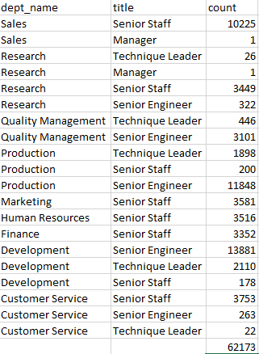

# Pewlett-Hackard-Analysis
 
## Overview of the analysis
For this challange, I am helping Pewlett- Hackard prepare for the upcoming "silver tsunami." Within the next few years, there will be a large number of employees retiring at a fast rate and the company wants to be prepared for this massive shift. Using the ERD attached below, we created new tables that helped us find these results.

## Results

To be prepared, I have focused on the following:
 
* Identifying by name, title, start date and the end date of retiring employees by job title.
* Determining the sum of retiring employees.
* Determining who is eligible for the mentorship program.
* Determining the number of employees that are eligible to fill the spots of retiring employees.

## Resources

Software used:
* PgAdmin 4
* Microsoft Excel
* Visual Studio COde

Data Sources:
* [CSV FILES CREATED](https://github.com/anrobertson/Pewlett-Hackard-Analysis/tree/main/Data)

## Summary

With the "silver tsunami" approaching, the company must prepare to have roles filled. Through my analysis I have come to find that we will need to fill 90,398 roles by creating a new table with each department name. Within those departments we find what title roles need to be filled and how many roles per title will be filled. To find this data, I took information from the "department name" table and the "title" table and joined them to my "roles to fill" table.

### Roles needed to be filled

In another table, I created a table that gathers the amount of staff that is qualified to mentor employees. This finding came to 62,173.

### Qualified staff that are able to mentor employees

